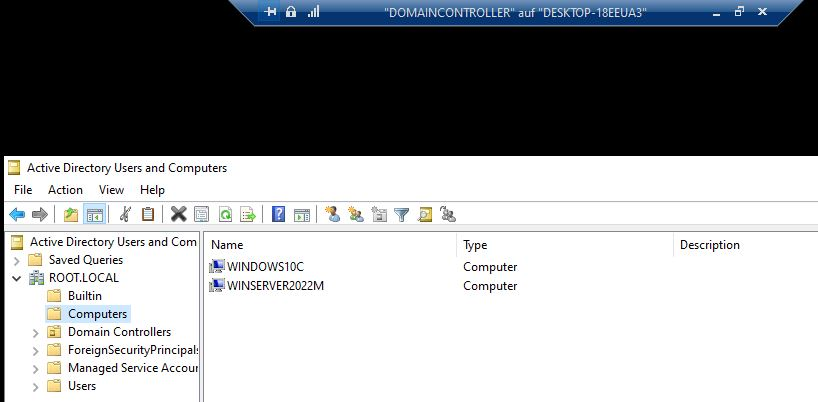

# Scripting
You can use PoweShell scripts to streamline workflows by:
- automating repetitive/administrative activities
- automating the build, test and deployment of your applications
- automating the configuration of your on-premise servers/systems
- automating the configuration of your Azure Cloud Platform
- automating the configuration of your Google Cloud Platform
- automating the configuration of your AWS Cloud Platform

## Set-Up PowerShell Environment

Note: I recommend you the PowerShell ISE (Integrated Scripting Environment) to write your scripts because it is built-in editor of Windows 10, 11 and it contains many features such as code completion, git integration.
These features will enhance your productivity. 

### Enable The Execution of Scripts on the system

Know the list of current execution policy of the system
~~~ps1
Get-ExecutionPolicy
~~~

Display the list of executions policies of the system and their corresponding scopes
~~~ps1
Get-ExecutionPolicy -list
~~~

If you have admin priviledges on the computer. All users of the computer will able to execute scripts. If a dialog box pop-up, choose "yes, all".
~~~ps1
Set-ExecutionPolicy -ExecutionPolicy Unrestricted -Scope LocalMachine  
~~~

If you have no admin priviledge on the computer. The current user will be able to execute scripts. If a dialog box pop-up, choose "yes, all".
~~~ps1
Set-ExecutionPolicy -ExecutionPolicy Unrestricted -Scope CurrentUser  
~~~

If you have no admin priviledge on the computer and you want to execute scripts on the current PowerShell session. If a dialog box pop-up, choose "yes, all".
~~~ps1
Set-ExecutionPolicy -ExecutionPolicy Unrestricted -Scope Process  
~~~

More details about the ExecutionPolicy [here](https://learn.microsoft.com/en-us/powershell/module/microsoft.powershell.security/get-executionpolicy?view=powershell-7.3)

### Set-Up Git Version Control System

~~~ps1
write-host "Install winget tool if you don't already have it, then type this command in command prompt or Powershell."
winget install --id Git.Git -e --source winget

Install-Module posh-git -Scope CurrentUser -Force
Install-Module posh-git -Scope CurrentUser -Force

Import-Module posh-git
Add-PoshGitToProfile -AllHosts

write-host "`nSetting the default global email and the name of the git user..." 
git config --global user.email "GitUserEmail"
git config --global user.name "GitUserName"
~~~

More details about Git-setup in PowerShell [here](https://git-scm.com/book/de/v2/Anhang-A%3A-Git-in-anderen-Umgebungen-Git-in-PowerShell)

If you see the error massage after pushing your work to GitHub, don't worry 
~~~ps1
+ git push
+ ~~~~~~~~
    + CategoryInfo          : NotSpecified: (To https://gith...l_scripting.git:String) [], RemoteException
    + FullyQualifiedErrorId : NativeCommandError
~~~
See a discussion about this essue [here](https://github.com/dahlbyk/posh-git/issues/109)

If Git find a directory unsafe because the current user is not the owner, run this command if you known who owns that directory
~~~ps1
git config --global --add safe.directory ${env:USERPROFILE}\PowerShellScripting
~~~

## Important Notions
A PowerShell (PS1) script is runned sequentially from the top to the buttom

The naming convention of PowerShell scripts is:
- CamelCase for variables and methods. Ex: NewUsersFromCsv, GetType()
- Camel-Case for type names. Ex: Get-LocalUser, Import-Csv

Everything is an object in PowerShell.

Always use the `Select-Object` command to filter object properties before using the `where-object` command to filter property values.

The comparison operators in PowerShell are case insensitive. Add a prefix `c` to make a case sensitive comparison.
Example: -eq is a case insensitve equality. -ceq is a case sensitive equality
- `Equality operators`: -eq, -ne, -gt, -ge, -lt, -le
- `Matching operators`: -like, -notlike, -match, -notmacht
- `Replacement operator`: -replace
- `Containement operators`: -contains, -notcontains, -in, -notin
- `Type operators`: -is, -isnot
- `Logical operators`: -and, -or, -not

When you work with the Get-Date object, pay attention of the system settings if the system language and region is not English
~~~ps1
$UFormat = Get-Date -UFormat "%A %m/%d/%Y %R %Z"
"Current Date in UFormat: " + $UFormat
$DayOfWeek1 = Get-Date -Format "dddd" # German
"Current Day of Week (System Language DE) .NetFormat: "+$DayOfWeek1
$DayOfWeek2 = Get-Date -UFormat "%A" # German
"Current Day of Week (System Language DE) UFormat: "+$DayOfWeek2
$CurrentDate = Get-Date # German
$DayOfWeek = $CurrentDate.DayOfWeek # English
"Current Day of Week: "+$DayOfWeek

<# OUTPUT
Current Date in .Net Format: Donnerstag 11.16.2023 07:57 +01:00
Current Date in UFormat: Donnerstag 11/16/2023 08:00 +01
Current Day of Week (System Language DE) .NetFormat: Donnerstag
Current Day of Week (System Language DE) UFormat: Donnerstag
Current Day of Week: Thursday
#>
~~~

Work with PowerShell Arrays
~~~ps1
# Declare the an empty rray
$EmptyArray = @()
'EmptyArray: '+$EmptyArray

# Declare an non empty Array
$NonEmptyArray = @('Zero')
'NonEmptyArray: '+$NonEmptyArray

$EmptyArray = $EmptyArray + 'First'
$EmptyArray += 'Second'
'EmptyArray after assignment: '+$EmptyArray

$NonEmptyArray += 'Third'
'NonEmptyArray after assignment: '+$NonEmptyArray

<# OUTPUT
EmptyArray: 
NonEmptyArray: Zero
EmptyArray after assignment: First Second
NonEmptyArray after assignment: Zero Third
#>
~~~

To concatenate Integer and String, enclose the integer into quotes
~~~ps1
$Array = @()
$Array = $Array + 'First'
$Array += 'Second'
$Array += 'Third'

[Int]$Count = 0

foreach($Item in $Array)
{
    "$Count"+". "+$Item # Int enclosed in quotes
    $Item+". "+$Count # Int not enclosed in quotes
    $count +=1
}
<# OUTPUT
0. First
First. 0
1. Second
Second. 1
2. Third
Third. 2
#>
~~~

A PowerShell Object is an Array of properties. Illustration
~~~ps1
$LocalUsers = Get-LocalUser
$LocalUsers.getType()
"First user: "
$LocalUsers[0] | Format-Table
"First user name: "+ $LocalUsers[0].Name
"First user enabled? "+ $LocalUsers[0].Enabled
"Last user: "
$LocalUsers[-1] | Format-Table
"Last user name: "+ $LocalUsers[-1].Name
"Last user enabled? "+ $LocalUsers[-1].Enabled

IsPublic IsSerial Name                                     BaseType                                                                                                                  
-------- -------- ----                                     --------                                                                                                                  
True     True     Object[]                                 System.Array                                                                                                              

First user: 
Name  Enabled Description    
----  ------- -----------    
admin True    Enabled account
First user name: admin
First user enabled? True

Last user: 
Name Enabled Description    
---- ------- -----------    
x    True    Enabled account
Last user name: x
Last user enabled? True
#>
~~~

The Import-Csv command enable you to have a object identical to a PowerShell Object.
~~~ps1
$UsersFromCsvObject = Import-csv -Path "${env:USERPROFILE}\PowerShellScripting\users.csv"
$UsersFromCsvObject.GetType()
$UsersFromCsvObject | Format-Table

<# OUTPUT
IsPublic IsSerial Name                                     BaseType                                                                                                                  
-------- -------- ----                                     --------                                                                                                                  
True     True     Object[]                                 System.Array 

LOGONNAME PASSWORDOFUSER DESCRIPTION
--------- -------------- -----------
user06    Pa55w.rd       Sales      
user07    Pa55w.rd       Support    
user08    Pa55w.rd       Managers  
#> 
~~~

The `Measure-Object` cmdlet performs calculations on the property values of objects. 
- You can use `Measure-Object` to count objects or count objects with a specified Property . 
- You can also use `Measure-Object` to calculate the Minimum , Maximum , Sum , StandardDeviation and Average of numeric values. 
- For String objects, you can also use `Measure-Object` to count the number of lines, words, and characters.

More about Measure-Object [here](https://learn.microsoft.com/en-us/powershell/module/microsoft.powershell.utility/measure-object?view=powershell-7.4)

Use Import-csv and Measure-Object to create new local users from a CSV file if they not exists.
~~~ps1
<#
Create a PowerShell script which will import these users locally. 
- Make sure that these users are able to login. 
- Also make sure that the department header in the CSV file will be the description property of the new localuser.
#>
Clear-Host

# Import the Csv file content as .Net object
$NewPersonals = Import-Csv -Path "${env:USERPROFILE}\PowerShellScripting\new_personal.csv"
$LocalUserNames = Get-LocalUser | Select-Object -ExpandProperty Name

# Iterate through the list of users
foreach($NewPersonal in $NewPersonals)
{
    if($NewPersonal.LOGINNAME -notin $LocalUserNames)
    {
        # Secure the user password
        $SecurePassword = ConvertTo-SecureString $NewPersonal.PASSWORD -AsPlainText -Force

        # Create a local user account
        $NewLocalUser = New-LocalUser -Name $NewPersonal.LOGINNAME -FullName $NewPersonal.NAME -Password $SecurePassword -Description $NewPersonal.DEPARTMENT

        # Add the user account to a local group Users so that he will be able to login
        Add-LocalGroupMember -Group "Benutzer" -Member $NewLocalUser.Name
        # Display the Users
        Get-LocalGroupMember -Group Benutzer

        # Delete a local user
        # Get-LocalUser | Where-Object {$_.Name -in ($NewLocalUser.Name)} | Remove-LocalUser
    }
}
~~~

Get-Verb. Running this command returns a list of verbs that most commands adhere to. The response includes a description of what these verbs do. Since most commands follow this naming convention, it sets expectations on what a command does. This helps you select the appropriate command and what to name a command, should you be creating one.

Get-Command. This command retrieves a list of all commands installed on your machine.

Get-Member. It operates on object based output and is able to discover what object, properties and methods are available for a command.

Get-Help. Invoking this command with the name of a command as an argument displays a help page describing various parts of a command.

## Common Commands

Run a script helloWorld.ps1 located in in the current directory
~~~ps1
C:\path\to\current\dir> .\helloWorld.ps1
~~~

Open a file in PowerShell ISE from the PowerShell command line
~~~ps1
C:\path\to\current\dir> powershell_ise.exe .\helloWorld.ps1
~~~
Open a file with his default application from the PowerShell command line
~~~ps1
C:\path\to\current\dir> Invoke-Item .\helloWorld.ps1
~~~

Ways to output a message 'Hello World' to the screen
~~~ps1
# Simplest way
'Hello World'

# With an object method
Write-Host 'Hello World'
~~~

Basic variable definition and usage
~~~ps1
$name = 'Foo'
'Hello '+$name
Write-Host 'Hello' $name

# Define a string variable
[String]$var1 = 1
[Int]$var2 = 1

# Deletes a variable and its value from the scope in which it is defined, such as the current session
Remove-Variable var1 # Deletes the $var1 variable.

# Display the type of a variable
$var1.getType() 
$var2.getType()
~~~

Handle User Input
~~~ps1
'Please give me your username:'
$username = Read-Host
'Your username is '+$username
'Thank you!' 
~~~

List all the commands installed on the computer, including cmdlets, aliases, functions, filters, scripts, and applications.
~~~ps1
# All commands
Get-Command

# Commands conaining the verb "Get"
Get-Command -Verb "Get*"

# Commands containing the noun "User"
Get-Command -Noun "*User*"
~~~

To see the class and all the members (methods and properties) of an object
~~~ps1
Get-LocalUser | Get-Member
~~~

If-elseif-else Condition Example
~~~ps1
# Uncomment the following command to see all local users on your system
# Get-LocalUser

$UserName = 'user01' # Set this to a local user existing in your system
# Get the local user object named $UserName
$UserObject = Get-LocalUser -Name $UserName
$UserObject

'Is the user ' + $UserName + ' enabled ? ' + $UserObject.Enabled

# Disable the user user01 if he is enabled
if($UserObject.Enabled -eq $True){
    Disable-LocalUser -InputObject $UserObject
    #Disable-LocalUser -Name $UserObject.Name # option 1
    $UserObject = Get-LocalUser -Name $UserObject.Name # option 2
    'If Is the user ' + $UserName + ' enabled ? ' + $UserObject.Enabled
# Or enable it if it his disabled
} else {
    Enable-LocalUser -InputObject $UserObject
    #Enable-LocalUser -Name $UserObject.Name # option 1
    $UserObject = Get-LocalUser -Name $UserObject.Name # option 2
    'Else Is the user ' + $UserName + ' enabled ? ' + $UserObject.Enabled
}
~~~

## PowerShell - Windows Batch - Linux/Mac Bash/Shell Commands
Tis section describes common Windows PowerShell Commands with their equivalent Windows Batch Commands or Linux/Mac Bash/Shell Commands.

Display the list of built-in aliases
~~~ps1
Get-Alias
~~~

Export a list of command - alias associations sorted alphabetically by the command definition
~~~ps1
# Save the list in a variable
$builtin_command_aliases = Get-Alias | Select-Object definition, name | Sort-Object -Property definition
# Export the list a csv file in the current directory. Override the the file if it already exists.
$builtin_command_aliases | Export-Csv -Path .\builtin_command_aliases.csv -Delimiter ';' -NoTypeInformation -Force
~~~

Display the aliases of a cmdlet. 
~~~ps1
# Example of: Get-ChildItem
Get-Alias -Definition Get-ChildItem

<# OUTPUT
CommandType     Name                                               Version    Source                                                                                                 
-----------     ----                                               -------    ------                                                                                                 
Alias           dir -> Get-ChildItem                                                                                                                                                 
Alias           gci -> Get-ChildItem                                                                                                                                                 
Alias           ls -> Get-ChildItem  
#>
~~~

|PowerShell Command|Batch Command|Bash/Shell Command|PowerShell Built-In Alias|PowerShell Command Description|
|---|---|---|---|---|
|Add-Content|||ac||
|Add-LocalGroupMember|||algm||
|Add-PSSnapIn|||asnp||
|Clear-Content|||clc||
|Clear-History|||clhy||
|Clear-Host|clear|cls|cls, clear||
|Clear-Item|||cli||
|Clear-ItemProperty|||clp||
|Clear-Variable|||clv||
|Compare-Object||diff|compare, diff||
|Connect-PSSession|||cnsn||
|ConvertFrom-String|||CFS||
|Convert-Path|||cvpa||
|Copy-Item|copy|cp|copy, cp, cpi||
|Copy-ItemProperty|||cpp||
|Disable-LocalUser|||dlu||
|Disable-PSBreakpoint|||dbp||
|Disconnect-PSSession|||dnsn||
|Enable-LocalUser|||elu||
|Enable-PSBreakpoint|||ebp||
|Enter-PSSession|||etsn||
|Exit-PSSession|||exsn||
|Export-Alias|||epal||
|Export-Csv|||epcsv||
|Export-PSSession|||epsn||
|ForEach-Object|||foreach, %||
|Format-Custom|||fc||
|Format-Hex|||fhx||
|Format-List|||fl||
|Format-Table|||ft||
|Format-Wide|||fw||
|Get-Alias|||gal||
|Get-ChildItem|dir|ls|gci, ls, dir||
|Get-Clipboard|||gcb||
|Get-Command|||gcm||
|Get-ComputerInfo|systeminfo||gin||
|Get-Content|type|cat|type, cat, gc||
|Get-Help|help|man|help, man||
|Get-History||history|ghy, h, history||
|Get-Item|||gi||
|Get-ItemProperty|||gp||
|Get-ItemPropertyValue|||gpv||
|Get-Job|||gjb||
|Get-LocalGroup|||glg||
|Get-LocalGroupMember|||glgm||
|Get-LocalUser|||glu||
|Get-Location||pwd|gl, pwd||
|Get-Member|||gm||
|Get-Module|||gmo||
|Get-Process||ps|ps, gps||
|Get-PSBreakpoint|||gbp||
|Get-PSCallStack|||gcs||
|Get-PSDrive|||gdr||
|Get-PSSession|||gsn||
|Get-PSSnapIn|||gsnp||
|Get-Service|||gsv||
|Get-TimeZone|||gtz||
|Get-Unique|||gu||
|Get-Variable|||gv||
|Get-WmiObject|||gwmi||
|Group-Object|||group||
|Import-Alias|||ipal||
|Import-Csv|||ipcsv||
|Import-Module|||ipmo||
|Import-PSSession|||ipsn||
|Invoke-Command|||icm||
|Invoke-Expression|||iex||
|Invoke-History|||ihy, r||
|Invoke-Item|||ii|Performs the default action on the specified item.|
|Invoke-RestMethod|||irm||
|Invoke-WebRequest||curl, wget|curl, wget, iwr||
|Invoke-WMIMethod|||iwmi||
|Measure-Object|||measure||
|mkdir||mkdir|md||
|Move-Item|||mi, move, mv||
|Move-ItemProperty|||mp||
|New-Alias|||nal||
|New-Item|||ni||
|New-Item -ItemType Directory|md|md, mkdir|ni||
|New-Item -ItemType File|type nul >, echo nul >|touch, cat >, echo >|ni||
|New-LocalGroup|||nlg||
|New-LocalUser|||nlu||
|New-Module|||nmo||
|New-PSDrive||mount|mount, ndr||
|New-PSSession|||nsn||
|New-PSSessionConfigurationFile|||npssc||
|New-Variable|||nv||
|Out-GridView|||ogv||
|Out-Host|||oh||
|Out-Printer|||lp||
|Pop-Location|||popd||
|powershell_ise.exe|||ise||
|Push-Location|||pushd||
|Receive-Job|||rcjb||
|Receive-PSSession|||rcsn||
|Remove-Item|del|rmdir, rm|erase, rmdir, del, rm, rd, ri||
|Remove-ItemProperty|||rp||
|Remove-Job|||rjb||
|Remove-LocalGroup|||rlg||
|Remove-LocalGroupMember|||rlgm||
|Remove-LocalUser|||rlu||
|Remove-Module|||rmo||
|Remove-PSBreakpoint|||rbp||
|Remove-PSDrive|||rdr||
|Remove-PSSession|||rsn||
|Remove-PSSnapin|||rsnp||
|Remove-Variable|||rv||
|Remove-WMIObject|||rwmi||
|Rename-Item|||rni, ren|Renames an item in a PowerShell provider namespace.|
|Rename-ItemProperty|||rnp||
|Rename-LocalGroup|||rnlg||
|Rename-LocalUser|||rnlu||
|Resolve-Path|||rvpa||
|Resume-Job|||rujb||
|Select-Object|||select||
|Select-String|||sls||
|Set-Alias|||sal||
|Set-Clipboard|||scb||
|Set-Content|||sc||
|Set-Item|||si||
|Set-ItemProperty|||sp||
|Set-LocalGroup|||slg||
|Set-LocalUser|||slu||
|Set-Location||cd|sl, cd chdir||
|Set-PSBreakpoint|||sbp||
|Set-TimeZone|||stz||
|Set-Variable|||sv, set||
|Set-WMIInstance|||swmi||
|Show-Command|||shcm||
|Sort-Object|||sort||
|Start-Job|||sajb||
|Start-Process|||saps, start||
|Start-Service|||sasv||
|Start-Sleep|||sleep||
|Stop-Job|||spjb||
|Stop-Process||kill|kill, spps||
|Stop-Service|||spsv||
|Suspend-Job|||sujb||
|Tee-Object|||tee||
|Trace-Command|||trcm||
|Wait-Job|||wjb||
|Where-Object|||?, where||
|Write-Output|echo||echo, write||

# Appendix

## Useful Resources
- [PowerShell from Beginner To Sheller And Scripter](https://www.udemy.com/course/powershell-from-beginner-to-sheller-and-scripter/)
- [Overview of PowerShell](https://learn.microsoft.com/en-us/powershell/scripting/overview?view=powershell-7.4)
- [PowerShell Bits tutorials](https://learn.microsoft.com/en-us/powershell/scripting/learn/tutorials/00-introduction)
- [Microsoft Virtual Academy videos](https://learn.microsoft.com/en-us/shows/browse?terms=powershell)
- [PowerShell Learn modules](https://learn.microsoft.com/en-us/training/browse/?terms=PowerShell)
- [Course AZ-040T00--A: Automating Administration with PowerShell](https://learn.microsoft.com/en-us/training/courses/az-040t00)
- [Migrating from Windows PowerShell 5.1 to PowerShell 7](https://learn.microsoft.com/en-us/powershell/scripting/whats-new/migrating-from-windows-powershell-51-to-powershell-7?view=powershell-7.4)
- [PowerShell remoting over SSH](https://learn.microsoft.com/en-us/powershell/scripting/learn/remoting/ssh-remoting-in-powershell-core)
- [Running Remote Commands](https://learn.microsoft.com/en-us/powershell/scripting/learn/remoting/running-remote-commands?view=powershell-7.4)
- [Building a CI/CD pipeline with DSC](https://learn.microsoft.com/en-us/azure/devops/pipelines/release/dsc-cicd)
- [Managing Microsoft Exchange](https://learn.microsoft.com/en-us/powershell/exchange/exchange-management-shell)
- [Azure Cloud Platform control from Windows PowerShell](https://learn.microsoft.com/en-us/powershell/azure/?view=azps-11.0.0)
- [Google Cloud Platform (GCP) control from Windows PowerShell](https://cloud.google.com/powershell)
- [AWS Cloud Platform control from Windows PowerShell](https://docs.aws.amazon.com/powershell/latest/userguide/pstools-getting-started.html)
- [Windows Server 2022 Evaluation ISO Download (expires in 180 days)](https://www.microsoft.com/de-de/evalcenter/download-windows-server-2022)
- [Windows 10 Evaluation ISO Download (expires in 90 days)](https://www.microsoft.com/de-de/evalcenter/download-windows-10-enterprise)

## Setup your Environment to access Windows Active Directory and Remote Desktops using PowerShel 

Hyper-V provides the services that you can use to create and manage virtual machines and their ressources. Each virtual machine is a virtualized computer system that operates in an isolated execution environment. 
This allows you to run multiple operating systems simultaneously.

### Install Hyper-V - Check Prerequisites

First make sure your Windows OS has these Hyper-V requirements enabled. This should be the case on any Microsoft Windows x `Pro` edition. N.B.: Microsoft Windows x `Home` editions don't support the Hypervisor (Hyper-V).

Prerequisites are:
- OS Name
- Memory Sizes availables
- Hyper-V Presence
~~~ps1
Get-ComputerInfo

<# OUTPUT
OsName                                                  : Microsoft Windows 10 Pro
...
OsTotalVisibleMemorySize                                : 4066664 (3.87GB)
OsFreePhysicalMemory                                    : 908004  (886.72MB)
OsTotalVirtualMemorySize                                : 6294888 (6.00GB)
OsFreeVirtualMemory                                     : 1975988 (1.88GB)
...
HyperVisorPresent                                       : False
HyperVRequirementDataExecutionPreventionAvailable       : True
HyperVRequirementSecondLevelAddressTranslation          : True
HyperVRequirementVirtualizationFirmwareEnabled          : True
HyperVRequirementVMMonitorModeExtensions                : True
#>
~~~
The Hypervisor is not present. HyperVisorPresent : `False`

Enable Windows-Feature "Hyper-V" by looking up "Turn Windows features on or off" via the Windows search field. 
- Check the option `Hyper-V`
- Click on `OK`
- Click on `restart now` to restart/reboot your computer to apply the changes.
~~~ps1
Get-ComputerInfo

<# OUTPUT
...
HyperVisorPresent                                       : True
HyperVRequirementDataExecutionPreventionAvailable       : 
HyperVRequirementSecondLevelAddressTranslation          : 
HyperVRequirementVirtualizationFirmwareEnabled          : 
HyperVRequirementVMMonitorModeExtensions                : 
#>
~~~
The hypervisor is should now be present. HyperVisorPresent : `True`

Type in Windows search field `Hyper-V-Manager` to start the Hyper-V Manager application.

### Set-Up the Virtual Machines on the Hyper-V

Download Windows Server 2022 und Windows 10 Evaluation ISO (Expire in 180/90 days)

Create a Private Virtual Switch called VLAN

Open Hyper-V-Manager

#### Create a private virtual switch (VLAN)
Create a private virtual switch that is isolated from everything else. 

Connect it to the private network. 

Rename it to VLAN and Click `Apply` then `OK`

#### Create the 3 Virtual Machines: DOMAINCONTROLLER, MEMBER and CLIENT

DOMAINCONTROLLER and MEMBER
- Name and Location: 
    - Name: DOMAINCONTROLLER 
    - Path: C:\ProgramData\Microsoft\Windows\Hyper-V\ (Default)
- Specify Generation: (Default: Generation 1) 
- Assign memory: 512MB per VM because only 1.88GB of free virtual memory is available in my machine
- Connect the new VM to the VLAN
- Connect the virtual hard disk
    - Name: DOMAINCONTROLLER.vhdx
    - Path: C:\ProgramData\Microsoft\Windows\Virtual Hard Disks\ (Default)
    - Size: 25GB (Depend on your needs and the free available disk on the physical computer
- Install the OS using the ISO image: ...\ISO\WindowsServer2022Evaluation180Days.iso
- Finish

CLIENT
- Name and Location: 
    - Name: CLIENT 
    - Path: C:\ProgramData\Microsoft\Windows\Hyper-V\ (Default)
- Specify Generation: (Default: Generation 1) 
- Assign memory: Min 1024MB per VM. I could run only one VM at a time because only 1.88GB of free virtual memory is available in my computer
- Connect the new VM to the VLAN
- Connect the virtual hard disk
    - Name: CLIENT.vhdx
    - Path: C:\ProgramData\Microsoft\Windows\Virtual Hard Disks\ (Default)
    - Size: 25GB (Depend on your needs and the free available disk on the physical computer
- Install the OS using the ISO image: ...\ISO\Windows10Evaluation32Bits90Days.iso
- Finish

#### Install the 3 Virtual Machines: DOMAINCONTROLLER, MEMBER1 and CLIENT
DOMAINCONTROLLER and MEMBER1
- During the installation make sure to choose the "Windows Server 2022 Standard Evaluation (Desktop Edition)" to install an OS having a GUI
- Choose custom install
- Username: Administrator (Default)
- Password:

CLIENT
- I don't have Internet
- Continue with limited setup
- Username: Admin
- 3 Security questions

#### Post-Configure the VMs

DOMAINCONTROLLER

Open PowerShell ISE as Administrator to rename the computers
~~~
# Max length: 15 characters
PS C:\Users\Administrator> hostname
# WIN-04FKCHO4CEA
PS C:\Users\Administrator> Rename-Computer -NewName WINSERVER2022DC
# WARNING: The changes will take effect after you restart the computer WIN-04FKCHO4CEA.
~~~

Select `Network and Internet Settings`
- Control Panel\Network and Internet\Network Connections
- Ethernet \ Ethernet Properties
- Select Internet Protocol Version 4 (TCP/IPv4)
- Click on `Properties`
- Select User the following IP address
    - Ipv4 Address: 192.168.1.1
    - IPv4 Mask: 255.255.255.0

~~~ps1
PS C:\Users\Administrator> Restart-Computer
~~~

~~~ps1
PS C:\Users\Administrator> hostname
# WINSERVER2022DC
~~~

MEMBER 
~~~ps1
PS C:\Users\Administrator> hostname
# WIN-GNP9B8HV8NG
PS C:\Users\Administrator> Rename-Computer -NewName WINSERVER2022M
# WARNING: The changes will take effect after you restart the computer WIN-GNP9B8HV8NG.
~~~
...
- Ipv4 Address: 192.168.1.2
- IPv4 Mask: 255.255.255.0

~~~ps1
PS C:\Users\Administrator> Restart-Computer
~~~

CLIENT
~~~ps1
hostname
# DESKTOP-A35QJ7M
PS C:\Windows\system32> Rename-Computer -NewName WINDOWS10C
# WARNING: The changes will take effect after you restart the computer DESKTOP-A35QJ7M.
~~~
...
- Ipv4 Address: 192.168.1.3
- IPv4 Mask: 255.255.255.0

~~~ps1
PS C:\Windows\system32> Restart-Computer
~~~

#### Install and Configure Active Directory

On the domain controller named WINSERVER2022DC

`Active Directory Domain Services (AD DS)` stores informations about users, computers, and other devices on the network. AD DS helps administratros securely manage this information and facilitates resource sharing and collaboration between users.
- To help ensure that users can still log on to the network in the case of a server outage, install a minimum of two domain controllers for a domain.
- AD DS requires a DNS server to be installed on the network.

Open Server Manager
- Select "Add roles and features" to determin which roles, role services, or features to install on the computing needs of your organization, such as sharing documents, or hosting a website.
    - Requirements
        - The Administrator account has a strong password
        - Network settings, such as static IP addresses, are configured
        - The most current security updates from Windows Update are installed
- Select the option "Role-based or feature-based installation"
- Select a server from the server pool
- Select "Active "Directory Domain Services". 
    - (AD DS) stores information about objects on thenetwork and makes this information available to users and network administrators. 
    - AD DS uses domain controllers to give network users access to permitted resources anywhere on the network through a single logon process.
- Features: conserve the default settings
- Features that will be installed are: (Select the option restart the computer)
    - Active Directory Domain Services
    - Group Policy Management
    - Remote Server Administration Tools
        - Role Administration Tools
            - AD DS and AD LDS Tools
                - Active Directory module for Windows PowerShell
                - AD DS Tools
                    - Active Dirctory Administrative Center
                    - AD DS Snap-Ins and Command-Line Tools
- As Post-deployment Configuration, select "Promote this server to the domain controller"
    - Select "Add a new forest", set the root domain name to: ROOT.LOCAL
    - Domain Controller Options: Keep the default settings and enter your Administrator password
    - Set the NetBIOS name to ROOT
    - Keep the default location of the AD DS database, log files, and SYSVOL to C:Windows\NTDS, C:Windows\SYSVOL
    - No worry about the warnings and click `install`

You can open "Windows Administration Tools" in the start menu to administrate your active directory.

On the member named WINSERVER2022M
- Under Control Panel / Network and Internet / Network Connections, set the Preferred DNS Server to: 192.168.1.1
- Under System and Security / Sysem / Advanced system settings / computer name, 
    - Computer description: WINSERVER2022M
    - Member of Domain: ROOT.LOCAL (Requirement: The domain controller must be reachable)
    - Computer Name/Domain Changes: administrator@root.local
- Restart the computer
- The domain controller (DC) administrator should be able lo login as: administrator (and his DC admin password)

On the client named WINDOWS10C
- Under Control Panel / Network and Internet / Network Connections, set the Preferred DNS Server to: 192.168.1.1
- Under System and Security / Sysem / Advanced system settings / computer name, 
    - Computer description: WINDOWS10C
    - Member of Domain: ROOT.LOCAL (Requirement: The domain controller must be reachable)
    - Computer Name/Domain Changes: administrator@root.local
- Restart the computer
- The domain controller administrator should be able lo login as: ROOT.LOCAL\administrator (and his DC admin password)

After these stepps WINSERVER2022M and WINDOWS10C should appear in the list of the AD computers.

#### Administrate Active Directory (AD) Users

Connect as `administrator` to the domain controller Virtual Machine `WINSERVER2022DC`

Display existing AD users
~~~ps1
Get-ADUser -Filter * | Select-Object DistinguishedName, Enabled, Name,  ObjectClass, SamAccountName, ObjectGUID | Format-Table

<# OUTPUT
DistinguishedName                          Enabled Name          ObjectClass SamAccountName ObjectGUID
-----------------                          ------- ----          ----------- -------------- ----------
CN=Administrator,CN=Users,DC=ROOT,DC=LOCAL    True Administrator user        Administrator  574349ff-1daa-4843-93eb-4eec8d7a952f
CN=Guest,CN=Users,DC=ROOT,DC=LOCAL           False Guest         user        Guest          ec3d5cf1-bab2-43bf-a8b1-6dbbf768ae3b
CN=krbtgt,CN=Users,DC=ROOT,DC=LOCAL          False krbtgt        user        krbtgt         84e70b57-019a-47d3-a664-c7ec0325820b
#>
~~~

Create a new Active Directory user
- The password of an AD user must be a SecureString
- new created AD users musss have a password and must be explicitely enabled to be able to login 
~~~ps1
$splat = @{
    Name = 'nken'
    DisplayName = "Nken-Ngénmbhi"
    Company = "Ngénmbhi"
    AccountPassword = (Read-Host -AsSecureString 'Type an Account Password Please')
    # AccountPassword = ConvertTo-SecureString -String 'Pa55w.rd' -AsPlainText -Force
    Enabled = $true
    Description = "Head of Human Ressources at Ngénmbhi SA"
}
New-ADUser @splat
~~~

Delete a Active Directory user account
~~~ps1
Remove-ADUser -Identity "CN=nken,CN=Users,DC=ROOT,DC=LOCAL"
~~~

~~~ps1
Get-ADUser -Filter * | Select-Object DistinguishedName, Enabled, Name,  ObjectClass, SamAccountName, ObjectGUID | Format-Table

<# OUTPUT
DistinguishedName                          Enabled Name          ObjectClass SamAccountName ObjectGUID
-----------------                          ------- ----          ----------- -------------- ----------
CN=Administrator,CN=Users,DC=ROOT,DC=LOCAL    True Administrator user        Administrator  574349ff-1daa-4843-93eb-4eec8d7a952f
CN=Guest,CN=Users,DC=ROOT,DC=LOCAL           False Guest         user        Guest          ec3d5cf1-bab2-43bf-a8b1-6dbbf768ae3b
CN=krbtgt,CN=Users,DC=ROOT,DC=LOCAL          False krbtgt        user        krbtgt         84e70b57-019a-47d3-a664-c7ec0325820b
CN=nken,CN=Users,DC=ROOT,DC=LOCAL             True nken          user        nken           5e397270-951c-402a-b514-d0149e70257b
#>
~~~

Retrieve the new created user by its SamAccountName `nken`.  
~~~ps1
# Remark: More logical would have been: Get-ADUser -SamAccountName "nken"
Get-ADUser -Identity "nken"

<# OUTPUT
DistinguishedName : CN=nken,CN=Users,DC=ROOT,DC=LOCAL
Enabled           : True
GivenName         :
Name              : nken
ObjectClass       : user
ObjectGUID        : 5e397270-951c-402a-b514-d0149e70257b
SamAccountName    : nken
SID               : S-1-5-21-1547265000-980589578-3749382528-1106
Surname           :
UserPrincipalName :
#>
~~~

Retrieve Active Directory groups
~~~ps1
Get-ADGroup -Filter * | Select-Object DistinguishedName, GroupScope, Name, ObjectClass | Format-Table

<# OUTPUT
DistinguishedName                                                     GroupScope Name                                    ObjectClass
-----------------                                                     ---------- ----                                    -----------
CN=Administrators,CN=Builtin,DC=ROOT,DC=LOCAL                        DomainLocal Administrators                          group
CN=Users,CN=Builtin,DC=ROOT,DC=LOCAL                                 DomainLocal Users                                   group
CN=Guests,CN=Builtin,DC=ROOT,DC=LOCAL                                DomainLocal Guests                                  group
...
#>
~~~

Add the user `nken` as new member of the AD group `Users` so that he can login to the domain controller VM WINSERVER2022DC
- The Add-ADGroupMember cmdlet adds one or more users, groups, service accounts, or computers as new members of an Active Directory group.
- The Identity parameter specifies the Active Directory group that receives the new members. 
- The Members parameter specifies the new members to add to a group. 
- You can identify an AD user or group by its `distinguished name`, `GUID`, `security identifier`, or `Security Account Manager (SAM) account name`.
~~~ps1
Add-ADGroupMember -Identity Users -Members nken
~~~
This command adds the user account with the SamAccountName `nken` to the group `Users`.

Display the members of the Active Directory group `Users`
~~~ps1
Get-ADGroupMember -Identity Users | Select-Object distinguishedName, name, objectClass, SamAccountName | Format-Table

<# OUTPUT
distinguishedName                         name                objectClass SamAccountName
-----------------                         ----                ----------- --------------
CN=nken,CN=Users,DC=ROOT,DC=LOCAL         nken                user        nken
CN=Domain Users,CN=Users,DC=ROOT,DC=LOCAL Domain Users        group       Domain Users
                                          Authenticated Users             Authenticated Users
                                          INTERACTIVE                     INTERACTIVE
#>
~~~

Create a new Active Directory user
- The password of an AD user must be a SecureString
- new created AD users musss have a password and must be explicitely enabled to be able to login 
~~~ps1
$splat = @{
    Name = 'testaduser'
    DisplayName = "Test AD User"
    AccountPassword = ConvertTo-SecureString -String 'Pa55w.rd' -AsPlainText -Force
    Enabled = $true
    Description = "Test AD User"
}
New-ADUser @splat
~~~

Retrieve the new created user by its SamAccountName `testaduser`.
~~~ps1
Get-ADUser -Identity "testaduser" - Properties *
<# OUTPUT
AccountExpirationDate                :
accountExpires                       : 9223372036854775807
AccountLockoutTime                   :
AccountNotDelegated                  : False
AllowReversiblePasswordEncryption    : False
AuthenticationPolicy                 : {}
AuthenticationPolicySilo             : {}
BadLogonCount                        : 0
badPasswordTime                      : 0
badPwdCount                          : 0
CannotChangePassword                 : False
CanonicalName                        : ROOT.LOCAL/Users/testaduser
Certificates                         : {}
City                                 :
CN                                   : testaduser
codePage                             : 0
Company                              :
CompoundIdentitySupported            : {}
Country                              :
countryCode                          : 0
Created                              : 15.12.2023 11:40:49
createTimeStamp                      : 15.12.2023 11:40:49
Deleted                              :
Department                           :
Description                          : Test AD User
DisplayName                          : Test AD User
DistinguishedName                    : CN=testaduser,CN=Users,DC=ROOT,DC=LOCAL
Division                             :
DoesNotRequirePreAuth                : False
dSCorePropagationData                : {01.01.1601 01:00:00}
EmailAddress                         :
EmployeeID                           :
EmployeeNumber                       :
Enabled                              : True
Fax                                  :
GivenName                            :
HomeDirectory                        :
HomedirRequired                      : False
HomeDrive                            :
HomePage                             :
HomePhone                            :
Initials                             :
instanceType                         : 4
isDeleted                            :
KerberosEncryptionType               : {}
LastBadPasswordAttempt               :
LastKnownParent                      :
lastLogoff                           : 0
lastLogon                            : 0
LastLogonDate                        :
LockedOut                            : False
logonCount                           : 0
LogonWorkstations                    :
Manager                              :
MemberOf                             : {}
MNSLogonAccount                      : False
MobilePhone                          :
Modified                             : 15.12.2023 11:40:49
modifyTimeStamp                      : 15.12.2023 11:40:49
msDS-User-Account-Control-Computed   : 0
Name                                 : testaduser
nTSecurityDescriptor                 : System.DirectoryServices.ActiveDirectorySecurity
ObjectCategory                       : CN=Person,CN=Schema,CN=Configuration,DC=ROOT,DC=LOCAL
ObjectClass                          : user
ObjectGUID                           : 7395cc50-2f4f-4b3e-aae5-d9cb46da4c69
objectSid                            : S-1-5-21-1547265000-980589578-3749382528-1107
Office                               :
OfficePhone                          :
Organization                         :
OtherName                            :
PasswordExpired                      : False
PasswordLastSet                      : 15.12.2023 11:40:49
PasswordNeverExpires                 : False
PasswordNotRequired                  : False
POBox                                :
PostalCode                           :
PrimaryGroup                         : CN=Domain Users,CN=Users,DC=ROOT,DC=LOCAL
primaryGroupID                       : 513
PrincipalsAllowedToDelegateToAccount : {}
ProfilePath                          :
ProtectedFromAccidentalDeletion      : False
pwdLastSet                           : 133471104491514676
SamAccountName                       : testaduser
sAMAccountType                       : 805306368
ScriptPath                           :
sDRightsEffective                    : 15
ServicePrincipalNames                : {}
SID                                  : S-1-5-21-1547265000-980589578-3749382528-1107
SIDHistory                           : {}
SmartcardLogonRequired               : False
State                                :
StreetAddress                        :
Surname                              :
Title                                :
TrustedForDelegation                 : False
TrustedToAuthForDelegation           : False
UseDESKeyOnly                        : False
userAccountControl                   : 512
userCertificate                      : {}
UserPrincipalName                    :
uSNChanged                           : 36898
uSNCreated                           : 36894
whenChanged                          : 15.12.2023 11:40:49
whenCreated                          : 15.12.2023 11:40:49
#>
~~~

A User member of the group `Users`

Open the folder `Active Directory Users and Computers`
- Right click on the folder `Users`, click `refresh` to refresh the list and see the new user testaduser
- Right click on `ROOT.LOCAL` choose `New` then `Organizational Unit` to create an organizational unit named "TestOU"
- Use the LDAP path `"OU=TestOU,DC=ROOT,DC=LOCAL"` to create a user in the organizational unit (OU) 
    ~~~ps1
    $splat = @{
        Name = "testouaduser"
        DisplayName = "Test OU AD User"
        AccountPassword = ConvertTo-SecureString -String "Pa55w.rd" -AsPlainText -Force
        Enabled = $true
        Description = "Test OU AD User"
        Path = "OU=TestOU,DC=ROOT,DC=LOCAL"
    }
    New-ADUser @splat
    ~~~

    Retrieve the new created user by its SamAccountName `testouaduser`.  
    ~~~ps1
    Get-ADUser -Identity "testouaduser" -Properties CanonicalName CN
    
    <# OUTPUT
    AccountExpirationDate                :
    accountExpires                       : 9223372036854775807
    AccountLockoutTime                   :
    AccountNotDelegated                  : False
    AllowReversiblePasswordEncryption    : False
    AuthenticationPolicy                 : {}
    AuthenticationPolicySilo             : {}
    BadLogonCount                        : 0
    badPasswordTime                      : 0
    badPwdCount                          : 0
    CannotChangePassword                 : False
    CanonicalName                        : ROOT.LOCAL/TestOU/testouaduser
    Certificates                         : {}
    City                                 :
    CN                                   : testouaduser
    codePage                             : 0
    Company                              :
    CompoundIdentitySupported            : {}
    Country                              :
    countryCode                          : 0
    Created                              : 15.12.2023 12:21:03
    createTimeStamp                      : 15.12.2023 12:21:03
    Deleted                              :
    Department                           :
    Description                          : Test OU AD User
    DisplayName                          : Test OU AD User
    DistinguishedName                    : CN=testouaduser,OU=TestOU,DC=ROOT,DC=LOCAL
    Division                             :
    DoesNotRequirePreAuth                : False
    dSCorePropagationData                : {01.01.1601 01:00:00}
    EmailAddress                         :
    EmployeeID                           :
    EmployeeNumber                       :
    Enabled                              : True
    Fax                                  :
    GivenName                            :
    HomeDirectory                        :
    HomedirRequired                      : False
    HomeDrive                            :
    HomePage                             :
    HomePhone                            :
    Initials                             :
    instanceType                         : 4
    isDeleted                            :
    KerberosEncryptionType               : {}
    LastBadPasswordAttempt               :
    LastKnownParent                      :
    lastLogoff                           : 0
    lastLogon                            : 0
    LastLogonDate                        :
    LockedOut                            : False
    logonCount                           : 0
    LogonWorkstations                    :
    Manager                              :
    MemberOf                             : {}
    MNSLogonAccount                      : False
    MobilePhone                          :
    Modified                             : 15.12.2023 12:21:03
    modifyTimeStamp                      : 15.12.2023 12:21:03
    msDS-User-Account-Control-Computed   : 0
    Name                                 : testouaduser
    nTSecurityDescriptor                 : System.DirectoryServices.ActiveDirectorySecurity
    ObjectCategory                       : CN=Person,CN=Schema,CN=Configuration,DC=ROOT,DC=LOCAL
    ObjectClass                          : user
    ObjectGUID                           : 29786684-af0b-4f38-b0db-e63a33de5cfa
    objectSid                            : S-1-5-21-1547265000-980589578-3749382528-1108
    Office                               :
    OfficePhone                          :
    Organization                         :
    OtherName                            :
    PasswordExpired                      : False
    PasswordLastSet                      : 15.12.2023 12:21:03
    PasswordNeverExpires                 : False
    PasswordNotRequired                  : False
    POBox                                :
    PostalCode                           :
    PrimaryGroup                         : CN=Domain Users,CN=Users,DC=ROOT,DC=LOCAL
    primaryGroupID                       : 513
    PrincipalsAllowedToDelegateToAccount : {}
    ProfilePath                          :
    ProtectedFromAccidentalDeletion      : False
    pwdLastSet                           : 133471128635183434
    SamAccountName                       : testouaduser
    sAMAccountType                       : 805306368
    ScriptPath                           :
    sDRightsEffective                    : 15
    ServicePrincipalNames                : {}
    SID                                  : S-1-5-21-1547265000-980589578-3749382528-1108
    SIDHistory                           : {}
    SmartcardLogonRequired               : False
    State                                :
    StreetAddress                        :
    Surname                              :
    Title                                :
    TrustedForDelegation                 : False
    TrustedToAuthForDelegation           : False
    UseDESKeyOnly                        : False
    userAccountControl                   : 512
    userCertificate                      : {}
    UserPrincipalName                    :
    uSNChanged                           : 40993
    uSNCreated                           : 40989
    whenChanged                          : 15.12.2023 12:21:03
    whenCreated                          : 15.12.2023 12:21:03
    #>
    ~~~

    A User member of the organizational unit `TestOU`
    ![Test OU AD User][testouaduser.JPG]

[testouaduser.JPG]: "multimedia/images/testouaduser.JPG"

Set the UserPrincipalName
~~~ps1
Set-ADUser -Identity "testouaduser" -UserPrincipalName "testouaduser@root.local"
ObjectGUID        : 29786684-af0b-4f38-b0db-e63a33de5cfa
Get-ADUser -Identity "testouaduser" -Properties * | Select-Object SamAccountName, Name, CN, UserPrincipalName, DistinguishedName, CanonicalName, PrimaryGroup, ObjectGUID, SID, whenCreated, whenChanged, ObjectClass, Enabled | Format-List

<# OUTPUT
SamAccountName    : testouaduser
Name              : testouaduser
CN                : testouaduser
UserPrincipalName : testouaduser@root.local
DistinguishedName : CN=testouaduser,OU=TestOU,DC=ROOT,DC=LOCAL
CanonicalName     : ROOT.LOCAL/TestOU/testouaduser
PrimaryGroup      : CN=Domain Users,CN=Users,DC=ROOT,DC=LOCAL
ObjectGUID        : 29786684-af0b-4f38-b0db-e63a33de5cfa
SID               : S-1-5-21-1547265000-980589578-3749382528-1108
whenCreated       : 15.12.2023 12:21:03
whenChanged       : 15.12.2023 18:09:05
ObjectClass       : user
Enabled           : True
#>
~~~

Create an AD OU
~~~ps1
New-ADOrganizationalUnit -Name "OUMoved"
~~~

Retrieve the AD user "nken"
~~~ps1
Get-ADUser -Identity "nken" -Properties * | Select-Object DistinguishedName | Format-List

# DistinguishedName : CN=nken,CN=Users,DC=ROOT,DC=LOCAL
~~~

Move the AD object "CN=nken,CN=Users,DC=ROOT,DC=LOCAL" from the default container for upgraded user accounts "Users" into the OU "OUMoved"
~~~ps1
Move-ADObject -Identity "CN=nken,CN=Users,DC=ROOT,DC=LOCAL" -TargetPath "OU=OUMoved,DC=ROOT,DC=LOCAL"
~~~

Retrieve the AD user "nken"
~~~ps1
Get-ADUser -Identity "nken" -Properties * | Select-Object DistinguishedName | Format-List

#DistinguishedName : CN=nken,OU=OUMoved,DC=ROOT,DC=LOCAL
~~~

#### Administrate remotely running Computer Clients or Servers located under the same Domain

Domain Controler Server: `WINSERVER2022DC`
Remote Server: `WINSERVER2022M`

The Enable-PSRemoting cmdlet configures the computer to receive PowerShell remote commands that are sent by using the WS-Management technology. 

PowerShell remoting is enabled by default on Windows Server platforms. You can use Enable-PSRemoting to enable PowerShell remoting on other supported versions of Windows and to re-enable remoting if it becomes disabled.

Execute a command on a remote Windows Server named `WINSERVER2022M` using a temporary session
~~~ps1
# Execute a command on the remote server
Invoke-Command -ComputerName WINSERVER2022M -ScriptBlock {$env:COMPUTERNAME}
<# OUTPUT
WINSERVER2022M
#>

# Execute a script on the remote server
# Invoke-Command -ComputerName WINSERVER2022M -FilePath "C:\Path\To\Script.ps1"

# Execute a command on many remote machines
# Invoke-Command -ComputerName WINSERVER2022M, WINDOWS10C -ScriptBlock {$env:COMPUTERNAME}
~~~

Enable PS Remoting on a Windows Client
~~~ps1
Enable-PSRemoting

<# OUTPUT
WinRM has been updated to receive requests.
The WinRM service type has been successfully changed.
The WinRM service has been started.
#>
~~~

Create a persistent connection/session to the remote Windows server named `WINSERVER2022M`
~~~ps1
Enter-PSSession WINSERVER2022M
<#
[WINSERVER2022M]: PS C:\Users\Administrator.ROOT\Documents> $env:COMPUTERNAME
WINSERVER2022M
#>
~~~

Exit the persistent session and Recreate it with the server full qualified name
~~~ps1
[WINSERVER2022M]: PS C:\Users\Administrator.ROOT\Documents> Exit-PSSession
PS C:\Users\Administrator> Enter-PSSession WINSERVER2022M.ROOT.LOCAL
[WINSERVER2022M.ROOT.LOCAL]: PS C:\Users\Administrator.ROOT\Documents> $env:COMPUTERNAME
WINSERVER2022M
~~~

# Final Project
A script that backups files from the source folder .\backlog to a destination folder .\_backup
~~~ps1
<#
This script backups files from 
.\backlog\
- file1.txt
- file2.csv
- file3.jpg
- file8.mp3
- file4.jpg
- file5.doc
- file6.bmp
- file7.mp3

to 
.\_backup\
- texts
    - file1.txt
    - file2.csv
    - file5.md
- images
    - file3.jpg
    - file4.jpg
    - file6.bmp
- audios
    - file8.mp3
    - file7.mp3
#>

Clear-Host

"Source folder ..."
$Backlog = ".\backlog"

if(!(Test-Path $Backlog))
{
	"Create the source folder and add files into it ..."
    New-Item -ItemType Directory 
    New-Item -ItemType File "${Backlog}\file1.txt"
    New-Item -ItemType File "${Backlog}\file2.csv"
    New-Item -ItemType File "${Backlog}\file3.jpg"
    New-Item -ItemType File "${Backlog}\file8.mp3"
    New-Item -ItemType File "${Backlog}\file4.jpg"
    New-Item -ItemType File "${Backlog}\file5.md"
    New-Item -ItemType File "${Backlog}\file6.bmp"
    New-Item -ItemType File "${Backlog}\file7.mp3"
}

"Retrieve files from the source folder ..."
Get-ChildItem -Path $Backlog -Recurse

$Destination = ".\_backup"
$Texts = ".\_backup\texts"
$Images = ".\_backup\images"
$Audios = ".\_backup\audios"
if(!(Test-Path $Destination))
{
    "The destionation folder doesn't exist ..."
    New-Item -ItemType Directory $Destination
    New-Item -ItemType Directory $Texts
    New-Item -ItemType Directory $Images
    New-Item -ItemType Directory $Audios
}
else
{
    "The destination folder exist. Check if the subfolders exists ..."
    if(!(Test-Path $Texts))
    {
        New-Item -ItemType Directory $Texts
    }
    if(!(Test-Path $Images))
    {
        New-Item -ItemType Directory $Images
    }
    if(!(Test-Path $Audios))
    {
        New-Item -ItemType Directory $Audios
    }
}

"Move the files in the appropriate destionation subfolder ..."
$files = Get-ChildItem $Backlog | Select-Object FullName, Name, Extension
foreach($file in $files)
{
    if($file.Extension -in @(".txt", ".csv", ".md"))
    {
        Copy-Item -Path $file.FullName -Destination $Texts
    }
    elseif($file.Extension -in @(".jpg", ".bmp"))
    {
        Copy-Item -Path $file.FullName -Destination $Images
    }
    elseif($file.Extension -in @(".mp3"))
    {
        Copy-Item -Path $file.FullName -Destination $Audios
    }
}

"Retrieve the content of all folders and subfolders"
"To check visually if the script did the job./."
Get-ChildItem -Path $Destination -Recurse

<# OUTPUT

Source folder ...
Retrieve files from the source folder ...

    Verzeichnis: C:\Users\admin\PowerShellScripting\backlog

Mode                 LastWriteTime         Length Name
----                 -------------         ------ ----
-a----        15.12.2023     22:35              0 file1.txt
-a----        15.12.2023     22:35              0 file2.csv
-a----        15.12.2023     22:35              0 file3.jpg
-a----        15.12.2023     22:35              0 file4.jpg
-a----        15.12.2023     22:35              0 file5.doc
-a----        15.12.2023     23:46              0 file5.md
-a----        15.12.2023     22:35              0 file6.bmp
-a----        15.12.2023     22:35              0 file7.mp3
-a----        15.12.2023     22:35              0 file8.mp3
The destionation folder doesn't exist ...

    Verzeichnis: C:\Users\admin\PowerShellScripting

Mode                 LastWriteTime         Length Name
----                 -------------         ------ ----
d-----        16.12.2023     00:04                _backup

    Verzeichnis: C:\Users\admin\PowerShellScripting\_backup

Mode                 LastWriteTime         Length Name
----                 -------------         ------ ----
Source folder ...
Retrieve files from the source folder ...

    Verzeichnis: C:\Users\admin\PowerShellScripting\backlog

Mode                 LastWriteTime         Length Name
----                 -------------         ------ ----
-a----        15.12.2023     22:35              0 file1.txt
-a----        15.12.2023     22:35              0 file2.csv
-a----        15.12.2023     22:35              0 file3.jpg
-a----        15.12.2023     22:35              0 file4.jpg
-a----        15.12.2023     22:35              0 file5.doc
-a----        15.12.2023     23:46              0 file5.md
-a----        15.12.2023     22:35              0 file6.bmp
-a----        15.12.2023     22:35              0 file7.mp3
-a----        15.12.2023     22:35              0 file8.mp3
The destination folder exist. Check if the subfolders exists ...
Move the files in the appropriate destionation subfolder ...
Retrieve the content of all folders and subfolders
To check visually if the script did the job./.

    Verzeichnis: C:\Users\admin\PowerShellScripting\_backup

Mode                 LastWriteTime         Length Name
----                 -------------         ------ ----
d-----        16.12.2023     00:04                audios
d-----        16.12.2023     00:04                images
d-----        16.12.2023     00:04                texts

    Verzeichnis: C:\Users\admin\PowerShellScripting\_backup\audios

Mode                 LastWriteTime         Length Name
----                 -------------         ------ ----
-a----        15.12.2023     22:35              0 file7.mp3
-a----        15.12.2023     22:35              0 file8.mp3

    Verzeichnis: C:\Users\admin\PowerShellScripting\_backup\images

Mode                 LastWriteTime         Length Name
----                 -------------         ------ ----
-a----        15.12.2023     22:35              0 file3.jpg
-a----        15.12.2023     22:35              0 file4.jpg
-a----        15.12.2023     22:35              0 file6.bmp

    Verzeichnis: C:\Users\admin\PowerShellScripting\_backup\texts

Mode                 LastWriteTime         Length Name
----                 -------------         ------ ----
-a----        15.12.2023     22:35              0 file1.txt
-a----        15.12.2023     22:35              0 file2.csv
-a----        15.12.2023     23:46              0 file5.md

#>
~~~